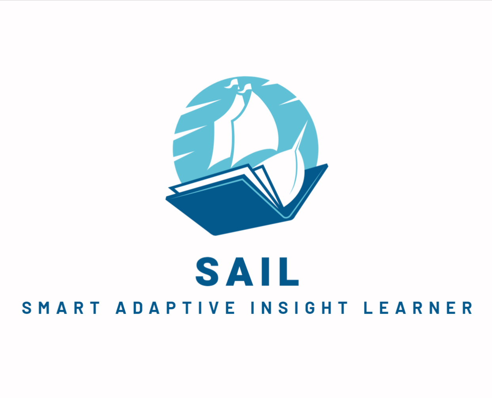
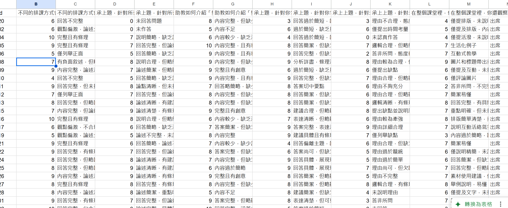

# SAIL - Smart Adaptive Insight Learner

SAIL is an innovative AI-driven educational analytics system designed to enhance form-based learning assessment. By leveraging advanced natural language processing and machine learning techniques, SAIL easily analyzes various forms and questionnaires, providing deep insights into student engagement, comprehension, and performance.

As a "Smart Adaptive Insight Learner," SAIL is specifically designed for Google Forms, with the capability to automatically recognize and classify different form contents. It adapts its analytical approach based on each form type, ensuring optimal data interpretation. The core of SAIL lies in its adaptive intelligent analysis mechanism, which separates form data into structured data (such as multiple-choice questions) and unstructured data (such as open-ended responses) and applies targeted analysis to each. Structured data undergoes statistical analysis and trend exploration, while unstructured data is processed using text analysis techniques to extract key insights and information.

Through intelligent integration and visual presentation, SAIL transforms complex data into clear, easy-to-understand analysis reports, enabling users to quickly grasp essential insights. Whether for educational institutions, corporate organizations, or research teams, SAIL provides an efficient and customizable data analytics solution, making the transition from data to knowledge seamless.

Key Features:
- Adaptive analysis of any form type
- Intelligent attendance tracking
- Sentiment analysis of student responses
- Automated evaluation of answer quality and relevance
- Customizable student data management
- Dynamic visualization of analysis results

SAIL empowers educators with real-time, actionable insights, enabling personalized learning strategies and more effective teaching methodologies. Whether you're managing a small classroom or a large educational institution, SAIL adapts to your needs, sailing you towards educational excellence.

## Usage
With the automated process, the analysis result will be filled in target sheet.
