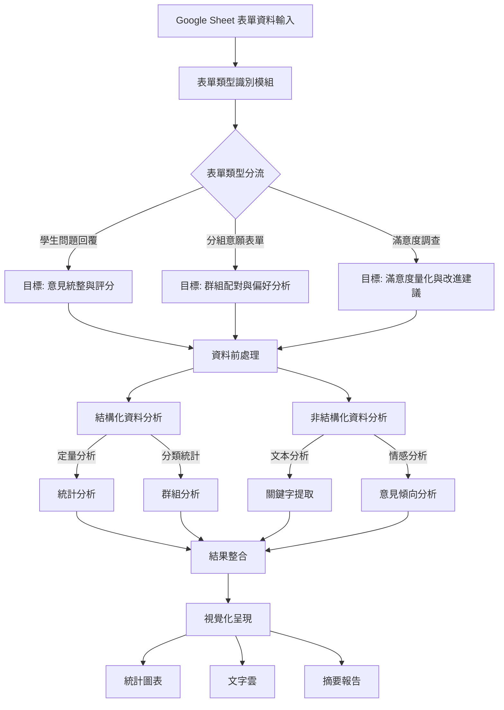

# SAIL
## Introduction
SAIL is an innovative, AI-powered educational analytics platform designed to revolutionize form-based learning assessment. By harnessing advanced natural language processing and machine learning techniques, SAIL effortlessly analyzes diverse forms and questionnaires, providing deep insights into student engagement, comprehension, and performance.

## Background

## Overview

1. **資料輸入階段**
   - 從 Google Sheet 匯入表單資料
   - 確保資料格式正確，進行基礎清理
2. **表單類型識別與目標設定**
   - 根據表單標題、問題類型自動識別表單類別
   - 為不同類型表單設定分析目標：
     * 學生問題回覆 → 統整意見、評分分析
     * 分組意願表單 → 偏好配對、群組分析
     * 滿意度調查 → 量化評估、建議整理
3. **資料前處理**
   - 區分結構化與非結構化資料
   - 資料清理（處理缺失值、異常值）
   - 格式標準化
4. **雙軌分析流程**
   - 結構化資料分析：
     * 統計分析（平均值、分布、趨勢）
     * 群組分析（分類統計、交叉分析）
   - 非結構化資料分析：
     * 文本分析（關鍵字提取、文本分類）
     * 情感分析（正面/負面意見識別）
5. **結果整合**
   - 合併定量和定性分析結果
   - 產生綜合性指標
   - 建立關聯性分析
6. **視覺化呈現**
   - 統計圖表（長條圖、圓餅圖、趨勢圖）
   - 文字雲（關鍵字視覺化）
   - 摘要報告（重點發現、建議）

系統特點：
1. 自動化：能自動識別表單類型並選擇適當的分析方法
2. 靈活性：可處理多種類型的表單和資料
3. 全面性：結合定量和定性分析
4. 視覺化：提供多種形式的結果呈現

結果輸出

生成完整分析報告
提供可操作的建議
支持人工審核和修正
自動執行後續操作(如發送回覆、更新分組等)

持續優化

收集反饋改進模型
更新知識庫
優化處理流程

## Functions
### StudentResponseEvaluation
1. Purposes

2. Functions

3. Input

4. Output

5. Lambda config setting
    - version: python 3.9
    - lib: 

### FromTopicAnalyzerReport
1. **Purposes**
   - The purpose of this Lambda function is to read student responses from an Excel file stored in S3, analyze the responses using AWS Bedrock, and generate topics for each question in the form.
2. **Functions**
   - `analyze_topics(questions)`: This function performs text analysis on each question in the form to identify the topics being discussed. It invokes an AWS Bedrock model to analyze the questions and returns the topics, summaries, and learning objectives in JSON format.
   - `upload_to_s3(data, bucket_name, file_name)`: This function uploads the given data to the specified S3 bucket, ensuring that the data is saved in UTF-8 encoding.
   - `lambda_handler(event, context)`: This is the main entry point for the Lambda function. It retrieves the Excel file from S3, extracts the questions, calls `analyze_topics` for topic analysis, and uploads the results to S3.
3. **Input**
   - The input for this Lambda function is an Excel file (e.g., `test.xlsx`) stored in S3, which contains student responses.
4. **Output**
   - The output of the function is a topic analysis for each question, stored in JSON format in S3 (e.g., `topic_analysis_results.json`). The output includes the topics, summaries, and learning objectives for each question, with an HTTP status code of 200 returned alongside the JSON response containing the analysis results.
5. Lambda config setting
    - version: python 3.9
    - lib: json, boto3, openpyxl, io

### CreateInsightReport
1. **Purposes**
    - This AWS Lambda function processes an Excel file containing student responses stored in an S3 bucket. The function analyzes these responses using the AWS Bedrock service to generate insightful reports and visualization suggestions for each question based on the collective responses.
2. **Functions**
    - `analyze_all_responses_for_insight(question, all_responses)`: This function takes a question and all the student responses for that question and uses AWS Bedrock's model to generate an insightful report. The report includes main points, commonalities, differences, strengths, weaknesses, and improvement suggestions based on the collective responses.
    - `suggest_chart_types_based_on_insight(insight_report)`: This function uses AWS Bedrock to suggest suitable chart types for visualizing the insights derived from the analysis of student responses. The output is a structured suggestion based on the type of data presented in the insight report.
   - `upload_to_s3(data, bucket_name, file_name)`: This function uploads a JSON file containing the generated insights and chart suggestions to the specified S3 bucket.
   - `lambda_handler(event, context)`: The main Lambda function handler that retrieves an Excel file from S3, processes student responses, invokes the analysis and chart suggestion functions, and stores the results in another S3 bucket. It handles the entire flow of reading the input file, analyzing responses, and outputting the results.
3. **Input**
    - **Excel file** stored in an S3 bucket containing student responses.
        - The Excel file format:
           - Row 1: Question headers.
           - Rows 2 and onwards: Each row contains a student's responses.
4. **Output**
   - **Insight Report**:  
      JSON data summarizing the collective insights for each question. This includes:
      - Overall insight.
      - Main points.
      - Commonalities.
      - Differences.
      - Strengths and weaknesses.
      - Depth and effectiveness.
      - Improvement suggestions.
   - **Chart Suggestions**:  
      Suggested types of charts (e.g., pie charts, bar charts) based on the analysis of the responses.
   - **S3 Output**:  
      - The function uploads a JSON file containing the insight report and chart suggestions to an S3 bucket. The file is saved as `insight_analysis_results.json`.
5. Lambda config setting
    - version: python 3.9
    - lib: json, boto3, openpyxl, io

### GenerateVisualizationReport
1. Purposes
    This Lambda function reads student responses from an Excel file stored in S3, analyzes the responses using AWS Bedrock, and generates attendent status, scores and insights for each student.
2. Functions

3. Input
    - S3 bucket: analysis-results-reports
    - S3 object
        - `student-response-evaluation.json`: Attendence information, analysis results from students' reponses
        - 

4. Output

5. Lambda config setting
    - version: python 3.9
    - lib: 

## AI
### AWS Bedrock
- model: 

## References
- [Packaging your layer content](https://docs.aws.amazon.com/lambda/latest/dg/packaging-layers.html)

## Tools
- [Draw.io](https://www.drawio.com/): generating diagram
- [Design.com](https://www.design.com/): generating logo
- [Perplexity](https://www.perplexity.ai/): Tools suggestions 
- [ChatGPT](https://chatgpt.com/): enhancing prompt words, architecture suggestions