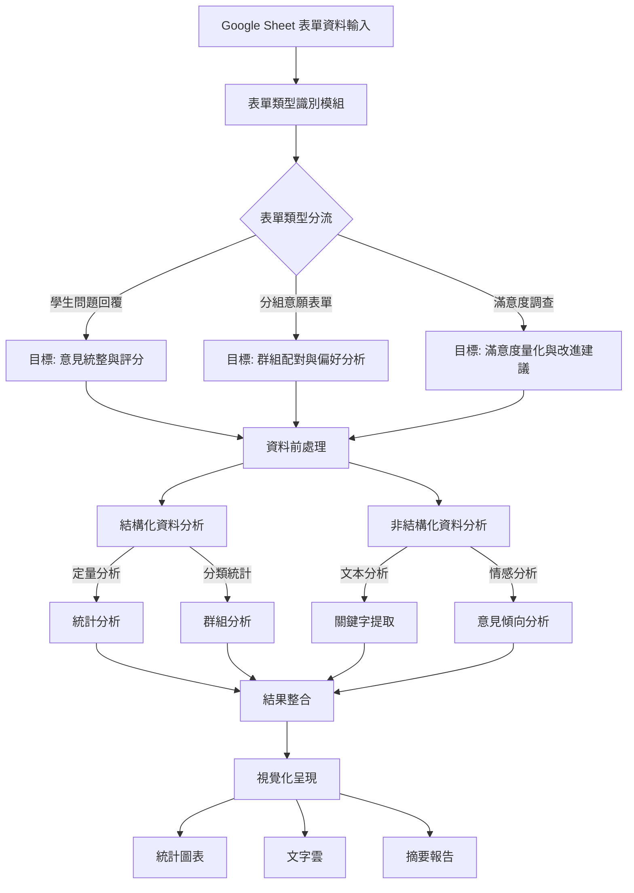

# SAIL
## Introduction
SAIL (Smart Adaptive Insight Learner) 是一款專為 Google Sheet 表單設計的智能分析系統，致力於透過自適應的分析技術來深化表單數據的洞察。這一系統具備自動識別與分類各類表單的能力，並根據不同表單類型自動調整分析策略，以實現最優的數據解析。

SAIL 的核心優勢在於其具備適應性的智能分析機制。系統會自動將表單內容劃分為結構化數據（如選擇題）和非結構化數據（如開放式問答），並對這兩種數據採取針對性的分析方法。對於結構化數據，SAIL 執行精確的統計分析與趨勢發掘；而針對非結構化數據，系統運用先進的文本分析技術，提取關鍵訊息和深入洞察。

通過智能整合與視覺化呈現，SAIL 能夠將繁雜數據轉化為清晰、易讀的分析報告，幫助使用者快速掌握表單背後的重要見解。無論是教育機構、企業組織，還是研究團隊，SAIL 都提供了高效且定制化的數據分析解決方案，真正實現了從數據到智慧的轉化。

## Background
SAIL 的誕生源於我們對簡化助教分析學生表單回覆工作的初衷，無論是學生意見調查、分組意願表單或滿意度調查等，SAIL 都能透過自動化流程，進行廣度與深度兼備的數據分析。這不僅有效減少了助教的繁重工作量，還讓助教能投入更多心力於課程設計，從而全面提升課程品質。

我們希望 SAIL 能成為助教的得力助手，以創新技術驅動教學流程，實現更高效、精準的教學支持。

## 系統實現
由於實現工具、流程修改等因素，SAIL 已經進入到第三版本，透過 AWS API Gateway、AWS Lambda、Coze、Google App Script 實現 Google 表單自動化分析。

## Overview

## AI
### AWS Bedrock
- model: 

## References
- [Packaging your layer content](https://docs.aws.amazon.com/lambda/latest/dg/packaging-layers.html)

## Tools
- [Draw.io](https://www.drawio.com/): generating diagram
- [Design.com](https://www.design.com/): generating logo
- [Perplexity](https://www.perplexity.ai/): Tools suggestions 
- [ChatGPT](https://chatgpt.com/): enhancing prompt words, architecture suggestions

## Appendix
設計草圖 v3

1. **資料輸入階段**
   - 從 Google Sheet 匯入表單資料
   - 確保資料格式正確，進行基礎清理
2. **表單類型識別與目標設定**
   - 根據表單標題、問題類型自動識別表單類別
   - 為不同類型表單設定分析目標：
     * 學生問題回覆 → 統整意見、評分分析
     * 分組意願表單 → 偏好配對、群組分析
     * 滿意度調查 → 量化評估、建議整理
3. **資料前處理**
   - 區分結構化與非結構化資料
   - 資料清理（處理缺失值、異常值）
   - 格式標準化
4. **雙軌分析流程**
   - 結構化資料分析：
     * 統計分析（平均值、分布、趨勢）
     * 群組分析（分類統計、交叉分析）
   - 非結構化資料分析：
     * 文本分析（關鍵字提取、文本分類）
     * 情感分析（正面/負面意見識別）
5. **結果整合**
   - 合併定量和定性分析結果
   - 產生綜合性指標
   - 建立關聯性分析
6. **視覺化呈現**
   - 統計圖表（長條圖、圓餅圖、趨勢圖）
   - 文字雲（關鍵字視覺化）
   - 摘要報告（重點發現、建議）
