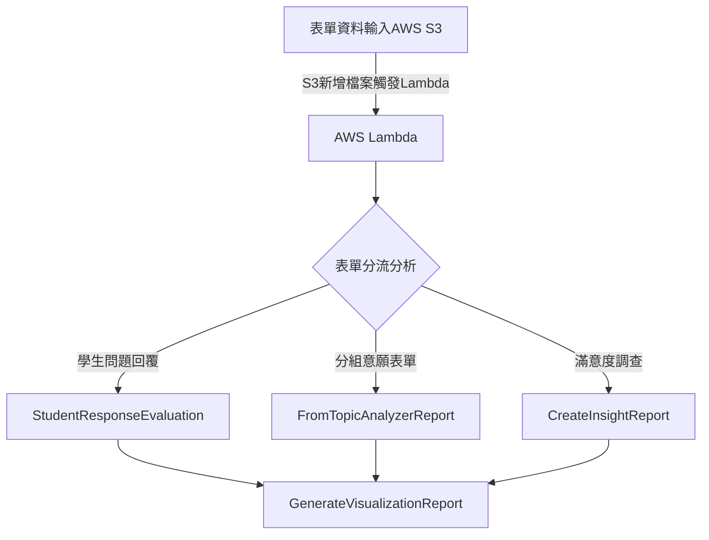

# v1
## Introduce
Version 1 represents the initial architecture of the SAIL system, where core functions (StudentResponseEvaluation, FromTopicAnalyzerReport, CreateInsightReport) perform preliminary analysis, and finally, the GenerateVisualizationReport function visualizes the analysis results.

## Diagram

## Functions
### StudentResponseEvaluation

1. **Purpose**
   - This Lambda function reads student responses from an Excel file stored in an S3 bucket, analyzes each response with AWS Bedrock, and calculates attendance status. The function aims to assess individual student responses, generate insights and scores, and keep track of attendance efficiently.

2. **Functions**
   - **`analyze_responses(question, responses, start_index)`**:
     - **Description**: This function performs text analysis on student responses for a given question using AWS Bedrock, generating a score and brief reason for each response. It processes responses in batches for optimal performance.
     - **Parameters**:
       - `question`: The question text being analyzed.
       - `responses`: Dictionary of student responses with `student_id` as keys.
       - `start_index`: Index to start processing from, useful for retrying in case of errors.
     - **Returns**: A list of dictionaries with each student’s `student_id`, `score`, and `reason`.
   - **`calculate_attendance(sheet, attendance_column_index)`**:
     - **Description**: Calculates attendance based on a specified column in the Excel sheet.
     - **Parameters**:
       - `sheet`: The active sheet in the Excel workbook.
       - `attendance_column_index`: The column index used to mark attendance (e.g., column A).
     - **Returns**: A tuple containing two sets: `present_students` (IDs of students who attended) and `absent_students` (IDs of students who were absent).
   - **`upload_to_s3(data, bucket_name, file_name)`**:
     - **Description**: Uploads data to a specified S3 bucket.
     - **Parameters**:
       - `data`: JSON data to be uploaded.
       - `bucket_name`: The S3 bucket name.
       - `file_name`: The desired file name in the S3 bucket.
     - **Returns**: None.
   - **`lambda_handler(event, context)`**:
     - **Description**: Main entry point for the Lambda function. Retrieves the Excel file from S3, processes responses and attendance, performs analysis, and uploads the results back to S3.
     - **Parameters**:
       - `event`: Contains the input event information (S3 trigger event).
       - `context`: Provides runtime information for the Lambda function.
     - **Returns**: A JSON response with analysis results and attendance status, along with an HTTP status code 200.
3. **Input**
   - The input is an Excel file (`test.xlsx`) containing student responses, stored in the S3 bucket named `student-excel-files`.
4. **Output**
   - **Analysis Results**: A JSON file named `student-response-evaluation.json` is generated, which contains scores and feedback for each student response based on the questions analyzed.
   - **Attendance Report**: An attendance summary, detailing `present_students` and `absent_students`, is included in the Lambda function’s JSON response.
5. **Lambda Configuration**
   - **Runtime**: Python 3.9
   - **Libraries**: `json`, `boto3`, `openpyxl`, `io`
   - **Environment Variables (optional)**:
     - S3 bucket names and model IDs for flexibility

### FromTopicAnalyzerReport
1. **Purposes**
   - The purpose of this Lambda function is to read student responses from an Excel file stored in S3, analyze the responses using AWS Bedrock, and generate topics for each question in the form.
2. **Functions**
   - `analyze_topics(questions)`: This function performs text analysis on each question in the form to identify the topics being discussed. It invokes an AWS Bedrock model to analyze the questions and returns the topics, summaries, and learning objectives in JSON format.
   - `upload_to_s3(data, bucket_name, file_name)`: This function uploads the given data to the specified S3 bucket, ensuring that the data is saved in UTF-8 encoding.
   - `lambda_handler(event, context)`: This is the main entry point for the Lambda function. It retrieves the Excel file from S3, extracts the questions, calls `analyze_topics` for topic analysis, and uploads the results to S3.
3. **Input**
   - The input for this Lambda function is an Excel file (e.g., `test.xlsx`) stored in S3, which contains student responses.
4. **Output**
   - The output of the function is a topic analysis for each question, stored in JSON format in S3 (e.g., `topic_analysis_results.json`). The output includes the topics, summaries, and learning objectives for each question, with an HTTP status code of 200 returned alongside the JSON response containing the analysis results.
5. Lambda config setting
    - version: python 3.9
    - lib: json, boto3, openpyxl, io

### CreateInsightReport
1. **Purposes**
    - This AWS Lambda function processes an Excel file containing student responses stored in an S3 bucket. The function analyzes these responses using the AWS Bedrock service to generate insightful reports and visualization suggestions for each question based on the collective responses.
2. **Functions**
    - `analyze_all_responses_for_insight(question, all_responses)`: This function takes a question and all the student responses for that question and uses AWS Bedrock's model to generate an insightful report. The report includes main points, commonalities, differences, strengths, weaknesses, and improvement suggestions based on the collective responses.
    - `suggest_chart_types_based_on_insight(insight_report)`: This function uses AWS Bedrock to suggest suitable chart types for visualizing the insights derived from the analysis of student responses. The output is a structured suggestion based on the type of data presented in the insight report.
   - `upload_to_s3(data, bucket_name, file_name)`: This function uploads a JSON file containing the generated insights and chart suggestions to the specified S3 bucket.
   - `lambda_handler(event, context)`: The main Lambda function handler that retrieves an Excel file from S3, processes student responses, invokes the analysis and chart suggestion functions, and stores the results in another S3 bucket. It handles the entire flow of reading the input file, analyzing responses, and outputting the results.
3. **Input**
    - **Excel file** stored in an S3 bucket containing student responses.
        - The Excel file format:
           - Row 1: Question headers.
           - Rows 2 and onwards: Each row contains a student's responses.
4. **Output**
   - **Insight Report**:  
      JSON data summarizing the collective insights for each question. This includes:
      - Overall insight.
      - Main points.
      - Commonalities.
      - Differences.
      - Strengths and weaknesses.
      - Depth and effectiveness.
      - Improvement suggestions.
   - **Chart Suggestions**:  
      Suggested types of charts (e.g., pie charts, bar charts) based on the analysis of the responses.
   - **S3 Output**:  
      - The function uploads a JSON file containing the insight report and chart suggestions to an S3 bucket. The file is saved as `insight_analysis_results.json`.
5. Lambda config setting
    - version: python 3.9
    - lib: json, boto3, openpyxl, io

### GenerateVisualizationReport

1. **Purposes**
   - The purpose of this Lambda function is to read student responses from an Excel file stored in S3, analyze the responses using AWS Bedrock, and generate topics for each question in the form.
2. **Functions**
   - analyze_topics(questions): This function performs text analysis on each question in the form to identify the topics being discussed. It invokes an AWS Bedrock model to analyze the questions and returns the topics, summaries, and learning objectives in JSON format.
   - upload_to_s3(data, bucket_name, file_name): This function uploads the given data to the specified S3 bucket, ensuring that the data is saved in UTF-8 encoding.
   - lambda_handler(event, context): This is the main entry point for the Lambda function. It retrieves the Excel file from S3, extracts the questions, calls analyze_topics for topic analysis, and uploads the results to S3.
3. **Input**
   - The input for this Lambda function is an Excel file (e.g., test.xlsx) stored in S3, which contains student responses.
4. **Output**
   - The output of the function is a topic analysis for each question, stored in JSON format in S3 (e.g., topic_analysis_results.json). The output includes the topics, summaries, and learning objectives for each question, with an HTTP status code of 200 returned alongside the JSON response containing the analysis results.
5. **Lambda config setting**
    - version: python 3.9
    - lib: json, boto3, openpyxl, io
